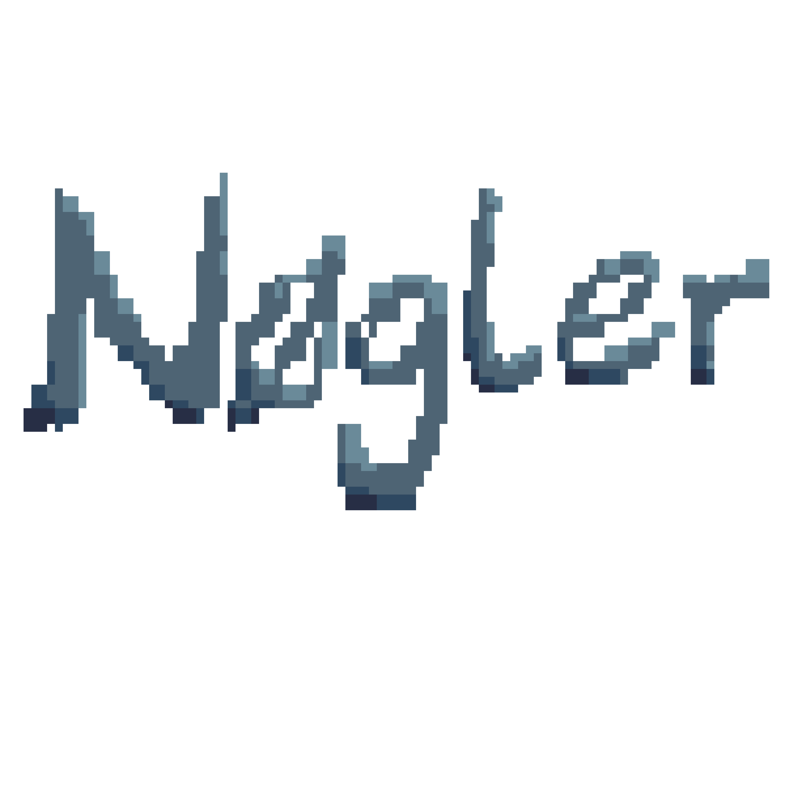

# Nogler's backend

This will be the backend for "Nogler", a multiplayer game based on "balatro" by LocalThunk, focused on creating a entertaining experience for players, in a multiplayer environment. It will maintain some of the original features, and the core game idea, as well as make some adaptations for a better multiplayer experience.

## Authors

- [@JSerranom04](https://github.com/JSerranom04)
 
- [@Yago-Torres](https://github.com/Yago-Torres)

- [@nicolas-pueyo](https://github.com/nicolas-pueyo)

- [@jmquilez](https://github.com/jmquilez)
  
- [@Ruben123454](https://github.com/Ruben123454)

## Core dependencies

go version 1.24
gin-gonic (https://github.com/gin-gonic/gin) version 1.10
socket.io (github.com/zishang520/socket.io/v2) version 2.3.8

The remaining dependencies can be found on go.mod

#### Relevant external versions

postgres version 15.12 (hosted on azure with education account)
go server hosted on raspberry Pi 4 B

## Deployment

To deploy this project run:

```
go mod tidy
go run cmd/main.go
```
Or compile it as a binary:
```
go mod tidy
go build cmd/main.go
./main
```

generate documentation:
```
swag init --output config/swagger
```



## Usage/Examples

#### Development server swagger docs

~~~ copy

http://nogler.ddns.net:8080
~~~

#### Production server swagger docs

~~~ copy

https://nogler.ddns.net:443
~~~
